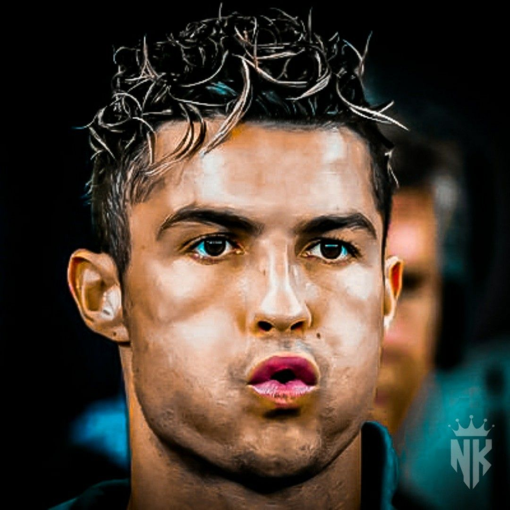

<!DOCTYPE html>
<html lang="en">
<head>
    <meta charset="UTF-8">
    <meta name="viewport" content="width=device-width, initial-scale=1.0">
    <title>Khaleeq's Personal Website</title>
    <link href="https://cdn.jsdelivr.net/npm/bootstrap@5.3.2/dist/css/bootstrap.min.css" rel="stylesheet" integrity="sha384-T3c6CoIi6uLrA9TneNEoa7RxnatzjcDSCmG1MXxSR1GAsXEV/Dwwykc2MPK8M2HN" crossorigin="anonymous">
    <link rel="stylesheet" href="./css/style.css">
</head>
<body>
    <!--Introduction-->
    <section id="Header">
        

            
              

                <h1 class="fw-bold"> Khaleeq </h1>
                <h2 class="head-title"> Software Development Graduate</h2>
              

            

          

    </section>

    <section id="Hero">
        

            
            <h2 class=" fw-bold text-body-emphasis pb-2">Welcome!</h2>
            

              
I am a Software Development Graduate hoping to build a career as a Software Developer. I love football and playing video games. <i class="bi bi-emoji-grin">
                <svg xmlns="http://www.w3.org/2000/svg" width="16" height="16" fill="currentColor" class="bi bi-emoji-grin" viewBox="0 0 16 16">
                    <path d="M12.946 11.398A6.002 6.002 0 0 1 2.108 9.14c-.114-.595.426-1.068 1.028-.997C4.405 8.289 6.48 8.5 8 8.5s3.595-.21 4.864-.358c.602-.07 1.142.402 1.028.998a5.953 5.953 0 0 1-.946 2.258Zm-.078-2.25C11.588 9.295 9.539 9.5 8 9.5c-1.54 0-3.589-.205-4.868-.352.11.468.286.91.517 1.317A36.797 36.797 0 0 0 8 10.75a36.796 36.796 0 0 0 4.351-.285c.231-.407.407-.85.517-1.317Zm-1.36 2.416c-1.02.1-2.255.186-3.508.186-1.253 0-2.488-.086-3.507-.186A4.985 4.985 0 0 0 8 13a4.986 4.986 0 0 0 3.507-1.436ZM6.488 7c.114-.294.179-.636.179-1 0-1.105-.597-2-1.334-2C4.597 4 4 4.895 4 6c0 .364.065.706.178 1 .23-.598.662-1 1.155-1 .494 0 .925.402 1.155 1M12 6c0 .364-.065.706-.178 1-.23-.598-.662-1-1.155-1-.494 0-.925.402-1.155 1a2.793 2.793 0 0 1-.179-1c0-1.105.597-2 1.334-2C11.403 4 12 4.895 12 6"/>
                    <path d="M8 16A8 8 0 1 0 8 0a8 8 0 0 0 0 16m0-1A7 7 0 1 1 8 1a7 7 0 0 1 0 14"/>
                  </svg>
              </i>

              

                
              

            

          

    </section>

    <section id="Resume">
      

        

          
          <h2 class="fw-bold">Education</h2>
          
Carlton Bolling College
 6 GCSE's including English and Maths

          

          
University of Bradford
 BEng Software Engineering: Grade 2.1

          

         
         
        

        

          
          <h2 class="fw-bold">Work Experience</h2>
          
NewDay
 Customer service helping customer's with credit card queries

          

          
        

        

        
          <h2 class="fw-bold">Skills</h2>
          
Design and Development
 Coding in HTML and CSS and designing websites

          

        

      

     
        
          

    
        

    </section>

    <section id="Projects">
      
  

      
    </section>

    <section id="Interests">
      

        <h2 class="display-6 fw-bold">About me</h2>
        
        

          
I am absolutely mad about football. I enjoy playing watching and playing football. I also enjoy playing football video games. My favourite football team and the team i support is Manchester United. 

          

            
          

        

        
      

    </section>

    <section id="Contact">
      

        <h2 class="display-6 fw-bold">Get In Touch</h2>
        <h3 style="color:darkslateblue">If you would like to know more about me</h3>
        

          
If you would like to know what projects i have done and if you would like to look at my code or if you generally just want to know more about me as a person. 

          

            <button type="button" class="btn btn-dark btn-lg px-4 me-sm-3">Contact Me</button>
            
          

        

        
      

    </section>
    

      <footer class="py-3 my-4 mb-0">
        <ul class="nav justify-content-center pb-3 mb-3">
          <li class="nav-item"><a href="https://www.linkedin.com/in/khaleeq-ahmed-744715151/" class="nav-link px-2">LinkedIn</a></li>

        </ul>
        
© Khaleeq Website

      </footer>
    

     
      
</body>
</html>
